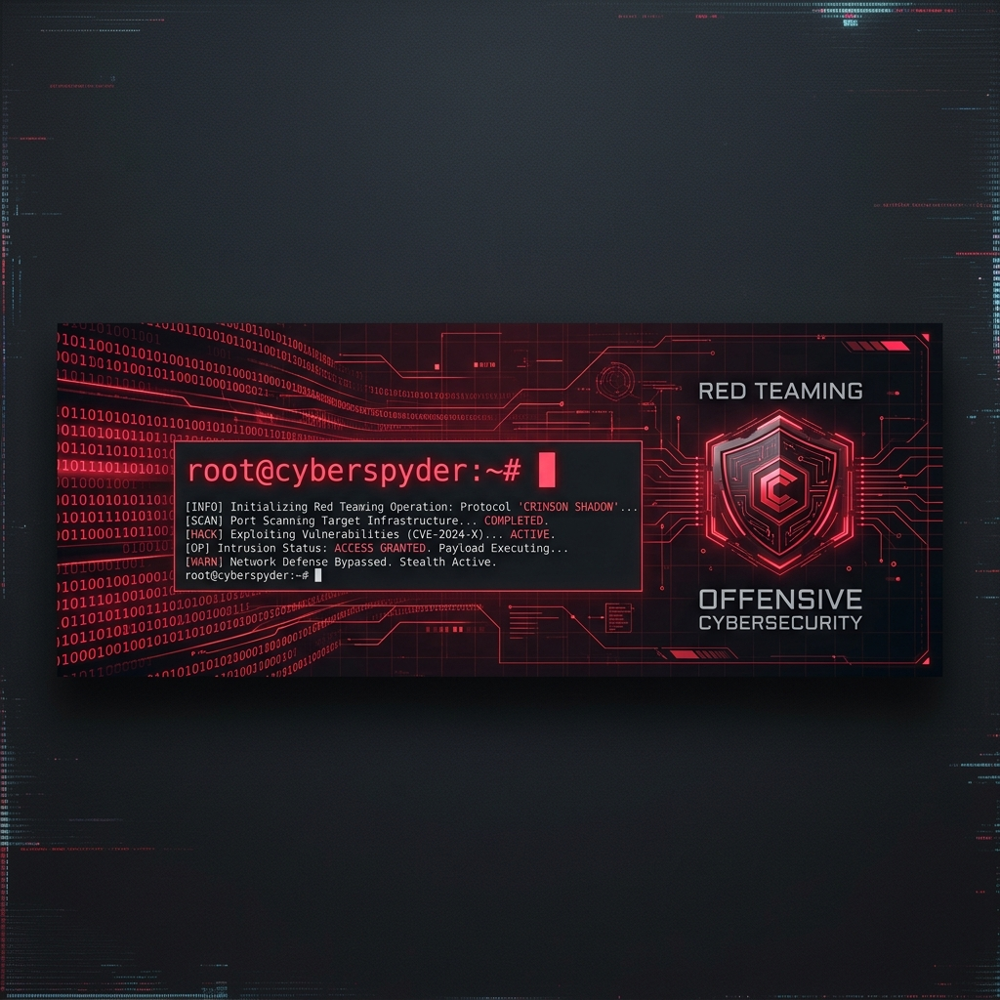

# 🔴 Offensive Security & IT Professional Profile

<!-- Header Banner -->

  

 

<!-- Badges Row -->

  
  
  
  

---

### 💻 System Terminal

<pre>
<b>[root@cybersec-ops ~]#</b> whoami
&gt; Professional IT Specialist | Offensive Cybersecurity Analyst | Red Teamer

<b>[root@cybersec-ops ~]#</b> cat profile.json
{
  "name": "Pedro H. Spains",
  "focus": ["Internal Networks", "Web Application Penetesting", "Active Directory Exploitation"],
  "mission": "Identifying vulnerabilities and securing systems by thinking like an adversary.",
  "status": "Actively seeking new opportunities in Offensive Security & Red Teaming"
}

<b>[root@cybersec-ops ~]#</b> systemctl status core-passion
● core-passion.service - Continuous Cybersecurity Lab Practice & Exploit Development
   Active: active (running) since always
</pre>

---

### 🛡️ Areas of Expertise

- **Infrastructure Penetration Testing**
  * Active Directory (AD) exploitation, lateral movement, domain escalation, and trust abuse.
  * Internal and external network security audits, vulnerability scanning, and manual verification.

- **Web Application Pentesting**
  * OWASP Top 10 exploitation (SQLi, XSS, SSRF, IDOR, RCE, Authentication Bypass).
  * REST API vulnerability assessments and business logic security analysis.

- **Red Team & Threat Simulation**
  * Mimicking adversary techniques, initial access vector design, and payload customization.
  * Evasion of basic detection controls, logging controls, and firewall configurations.

- **Security Automation & Scripting**
  * Custom scanner development, exploit scripting, and automated scanning using Bash, Python, and Go.

---

### 🔧 Tech Armory

<table width="100%">
  <tr>
    <td width="50%" valign="top">
      <h4>🛠️ Offensive Tools & OS</h4>
      
      
      
      
      
    </td>
    <td width="50%" valign="top">
      <h4>💻 Languages & Scripts</h4>
      
      
      
      
    </td>
  </tr>
  <tr>
    <td width="50%" valign="top">
      <h4>🌐 Network & Infrastructure</h4>
      
      
      
    </td>
    <td width="50%" valign="top">
      <h4>📖 Standards & Frameworks</h4>
      
      
      
    </td>
  </tr>
</table>

---

### 🎓 Certifications

> [!NOTE]
> Here are the certifications I have obtained or am currently pursuing:

- 🥇 **[Nome da Certificação, ex: OSCP]** - *Status*
- 🥈 **[Nome da Certificação, ex: CEH]** - *Status*
- 🥉 **[Nome da Certificação, ex: Security+]** - *Status*

---

### 🎯 Hacking Arenas

  <table width="100%">
    <tr>
      <td align="center" width="50%">
        <!-- Substitua SEU_USER_DO_TRYHACKME pelo seu usuário real -->
        
      </td>
      <td align="center" width="50%">
        <!-- Substitua SEU_ID_DO_HACKTHEBOX pelo seu ID real -->
        
      </td>
    </tr>
  </table>

---

### 📊 System Metrics

  <table width="100%">
    <tr>
      <td align="center" width="50%">
        <!-- Substitua SEU_USER_DO_GITHUB abaixo -->
        
      </td>
      <td align="center" width="50%">
        <!-- Substitua SEU_USER_DO_GITHUB abaixo -->
        
      </td>
    </tr>
  </table>

---

### 📬 Establish Connection

  
  
  <!-- Opcional: Blog ou Writeups -->
  

