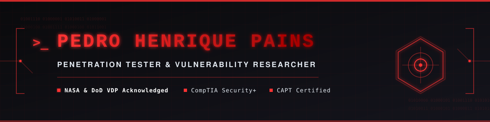

Aqui está o conteúdo final do seu `README.md` atualizado para usar o banner personalizado em SVG:

```markdown
# 🔴 Penetration Testing & IT Security Professional

<!-- Header Banner -->
<div align="center">
  
</div>

<br>

<!-- Badges Row -->
<p align="center">
  
  
  
</p>

---

### 💻 System Terminal

<pre>
<font color="#ff3333"><b>[root@pentest-ops ~]#</b></font> whoami
<font color="#ffffff">&gt; IT Specialist | Penetration Tester | Vulnerability Researcher</font>

<font color="#ff3333"><b>[root@pentest-ops ~]#</b></font> cat profile.json
<font color="#00ffcc">{
  "name": "Pedro Henrique Pains",
  "focus": ["Web Pentesting", "Network Pentesting", "API Testing"],
  "hall_of_fame": ["NASA", "U.S. Department of Defense (DoD)", "State of California"],
  "status": "Ready for high-impact Pentesting & IT Security opportunities"
}</font>

<font color="#ff3333"><b>[root@pentest-ops ~]#</b></font> systemctl status core-passion
<font color="#33cc33">● core-passion.service - Penetration Testing Lab Practice & Security Auditing
   Active: active (running) since always</font>
</pre>

---

### 🏆 Key Achievements & Hall of Fame

> [!IMPORTANT]
> Acknowledged for reporting critical vulnerabilities and securing public, state, and federal infrastructure through Vulnerability Disclosure Programs (VDPs):

* 🚀 **NASA (National Aeronautics and Space Administration)**: Received a formal **Letter of Recognition** for contributing to the security of NASA's digital assets.
* 🛡️ **U.S. Department of Defense (DoD)**: Acknowledged for finding and reporting vulnerabilities, helping secure federal/military digital infrastructure.
* 🐻 **State of California**: Disclosed security vulnerabilities to assist in protecting state-level public sector assets.

---

### 🛡️ Areas of Expertise

- **Web Application Penetration Testing**
  * OWASP Top 10 auditing (SQL Injection, Cross-Site Scripting, RCE, IDOR, SSRF, Broken Auth).
  * Business logic bypasses, session management flaws, and server-side vulnerabilities.

- **API & Web Services Security**
  * Vulnerability assessment of REST/GraphQL API endpoints.
  * Token validation flaws (JWT, OAuth), rate-limiting bypass, and request tampering.

- **Network & Infrastructure Security Auditing**
  * Port scanning, protocol analysis, and configuration reviews.
  * Active Directory (AD) auditing, domain privilege escalation vectors, and lateral movement detection.

- **Vulnerability Research & VDPs**
  * Reconnaissance, target surface mapping, and writing actionable, professional Proof of Concept (PoC) reports.

---

### 🔧 Tech Armory

<table width="100%">
  <tr>
    <td width="50%" valign="top">
      <h4>🛠️ Pentest Tools & OS</h4>
      
      
      
      
      
      
      
      
      
      
      
      
    </td>
    <td width="50%" valign="top">
      <h4>💻 Languages & Scripts</h4>
      
      
      
    </td>
  </tr>
  <tr>
    <td width="50%" valign="top">
      <h4>🌐 Network & Infrastructure</h4>
      
      
    </td>
    <td width="50%" valign="top">
      <h4>📖 Standards & Methodologies</h4>
      
      
      
    </td>
  </tr>
</table>

---

### 🎓 Certifications

* 🥇 **CompTIA Security+** 
  > *Validates core knowledge of foundational cybersecurity principles, network security architecture, risk management, threat identification, and hands-on vulnerability troubleshooting.*
* 🥈 **CAPT (Certified Associate Penetration Tester) - Hackviser**
  > *Demonstrates practical, hands-on capabilities in web application pentesting, network scanning, exploitation methodologies, and securing vulnerabilities in Active Directory environments.*
* 🥉 **Google Cybersecurity Professional Certificate**
  > *Validates hands-on technical skills in threat analysis, network traffic monitoring (Wireshark), Python security automation, Linux CLI operations, and incident response frameworks (NIST).*

---

### 🎯 Hacking Arenas

<div align="center">
  <table width="100%">
    <tr>
      <td align="center">
        <!-- TryHackMe Profile Badge -->
        <a href="https://tryhackme.com/p/pains">
          
        </a>
      </td>
    </tr>
  </table>
</div>

---

### 📊 System Metrics

<div align="center">
  <table width="100%">
    <tr>
      <td align="center" width="50%">
        <!-- GitHub Stats -->
        <a href="https://github.com/pedrohospains">
          
        </a>
      </td>
      <td align="center" width="50%">
        <!-- Top Languages -->
        <a href="https://github.com/pedrohospains">
          
        </a>
      </td>
    </tr>
  </table>
</div>

---

### 📬 Establish Connection

<p align="center">
  <a href="mailto:pedrohospains@gmail.com">
    
  </a>
  <a href="https://linkedin.com/in/pedropains" target="_blank">
    
  </a>
</p>
```
