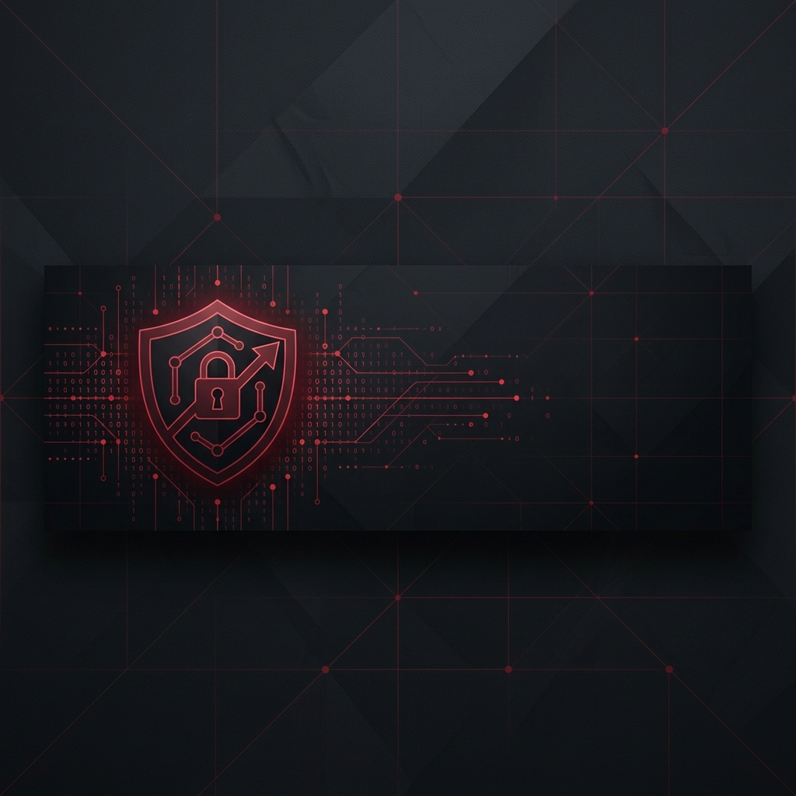

# 🔴 Penetration Testing & IT Security Professional

<!-- Header Banner -->

  

 

<!-- Badges Row -->

  
  
  
  

---

### 💻 System Terminal

<pre>
<b>[root@pentest-ops ~]#</b> whoami
&gt; IT Specialist | Penetration Tester | Vulnerability Researcher

<b>[root@pentest-ops ~]#</b> cat profile.json
{
  "name": "Pedro H. Spains",
  "focus": ["Web Pentesting", "Network Pentesting", "Vulnerability Disclosure Programs"],
  "hall_of_fame": ["NASA", "U.S. Department of Defense (DoD)", "State of California"],
  "status": "Ready for high-impact Pentesting & IT Security opportunities"
}

<b>[root@pentest-ops ~]#</b> systemctl status core-passion
● core-passion.service - Penetration Testing Lab Practice & Security Auditing
   Active: active (running) since always
</pre>

---

### 🏆 Key Achievements & Hall of Fame

> [!IMPORTANT]
> Acknowledged for reporting critical vulnerabilities and securing public and governmental infrastructure through Vulnerability Disclosure Programs (VDPs):

* 🚀 **NASA (National Aeronautics and Space Administration)**: Received a formal **Letter of Recognition** for contributing to the security of NASA's digital assets.
* 🛡️ **U.S. Department of Defense (DoD)**: Acknowledged for finding and reporting vulnerabilities, helping secure military-grade infrastructure.
* 🐻 **State of California**: Disclosed security vulnerabilities to assist in protecting public sector assets.

---

### 🛡️ Areas of Expertise

- **Network Penetration Testing**
  * Internal/external security audits, service exploitation, configuration review, and network mapping.
  * Active Directory (AD) auditing, domain privilege escalation vectors, and post-exploitation.

- **Web Application & API Pentesting**
  * OWASP Top 10 auditing (SQL Injection, Cross-Site Scripting, RCE, IDOR, SSRF, Broken Auth).
  * API endpoints mapping, parameter tampering, and business logic bypasses.

- **Vulnerability Research & VDPs**
  * Security auditing of public assets, reconnaissance, and writing professional proof-of-concept (PoC) reports.

- **IT Security Infrastructure**
  * Hardening operating systems, security troubleshooting, and networking administration.

---

### 🔧 Tech Armory

<table width="100%">
  <tr>
    <td width="50%" valign="top">
      <h4>🛠️ Pentest Tools & OS</h4>
      
      
      
      
      
    </td>
    <td width="50%" valign="top">
      <h4>💻 Languages & Scripts</h4>
      
      
      
      
    </td>
  </tr>
  <tr>
    <td width="50%" valign="top">
      <h4>🌐 Network & Infrastructure</h4>
      
      
      
    </td>
    <td width="50%" valign="top">
      <h4>📖 Standards & Methodologies</h4>
      
      
      
    </td>
  </tr>
</table>

---

### 🎓 Certifications

* 🥇 **CompTIA Security+** - *Active Security Practitioner*
* 🥈 **CAPT (Certified Applied Penetration Tester)** - *Hackviser*
* 🥉 **Google Cybersecurity Professional Certificate** - *Foundational Security & Incident Response*

---

### 🎯 Hacking Arenas

  <table width="100%">
    <tr>
      <td align="center" width="50%">
        <!-- Substitua pelo seu usuário TryHackMe -->
        
      </td>
      <td align="center" width="50%">
        <!-- Substitua pelo seu ID HackTheBox -->
        
      </td>
    </tr>
  </table>

---

### 📊 System Metrics

  <table width="100%">
    <tr>
      <td align="center" width="50%">
        <!-- Substitua pelo seu usuário real do GitHub -->
        
      </td>
      <td align="center" width="50%">
        <!-- Substitua pelo seu usuário real do GitHub -->
        
      </td>
    </tr>
  </table>

---

### 📬 Establish Connection

  
  
  

